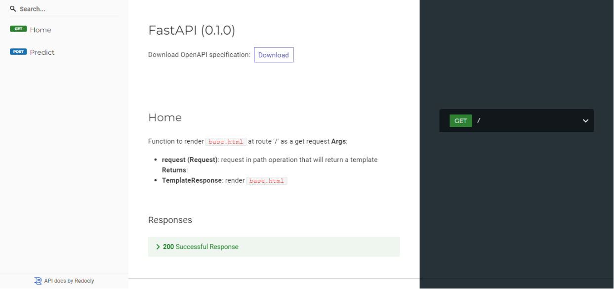

# SMS Spam Classifier


SMS Spam Classifier app is used to predict if the given input message is spam or not. The app created using python's scikit-learn, fastapi, pandas, nltk and joblib packages.

## Installation
Open Anaconda prompt and create new environment
```
conda create -n your_env_name python=(any version < 3.10.4)
```
Then Activate the newly created environment
```
conda activate your_env_name
```
Clone the repository using `git`
```
git clone https://github.com/Prakashdeveloper03/SMS-Spam-Classifier.git
```
Change to the cloned directory
```
cd <directory_name>
```
To install all requirement packages for the app
```
pip install -r requirements.txt
```
Then, Run the app
```
uvicorn main:app --reload
```
## 📷 Screenshots
### Spam Result

### Not Spam Result

### Swagger UI

### Redoc UI

